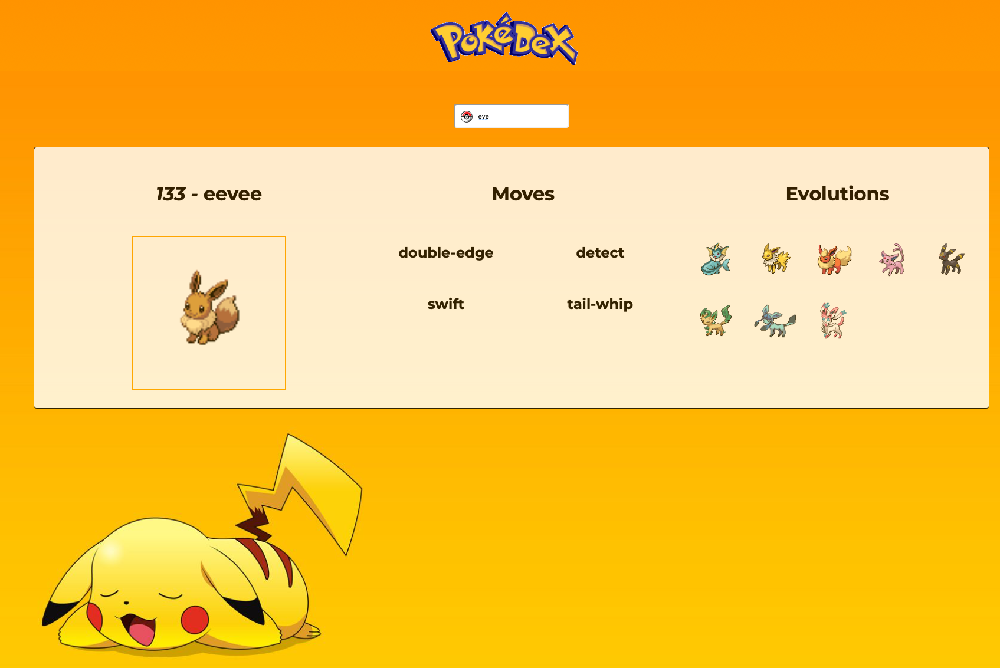

# Javascript Pokedex #

For our training at BeCode we (Julio and Marte) worked on a Pokedex. You can find our finished result [here](https://juliocesarteixeira.github.io/Pokedex_API/index.html).

## Learning Objectives ##
* A typical AJAX flow: send asynchronous requests to a remote server and process the results;
* JSON (JavaScript Object Notation) format;
* DOM manipulation: changing the DOM based on results of AJAX-requests.

## The exercise ##
Make a Pokédex using this API.

Basic functionality that is expected (read: core features):

* You can search a pokémon by name and by ID
* Of said pokémon you need to show:
    * The ID-number
    * An image (sprite)
    * At least 4 "moves"
    * The previous evolution, only if it exists, along with their name and image. Be carefull, you cannot just do ID-1 to get the previous form, for example look into "magmar" - "magmortar". You have to use a seperate api call for this!
    
Make your web page look like a pokédex by adding a little CSS.

## Extra challenge ##
There are a couple of pokemon that don't play with the normal rules, add code so their cases are also handled elegantly.

* Ditto only has 1 move.
* Eevee has 6 evolutions.

## The result ##

